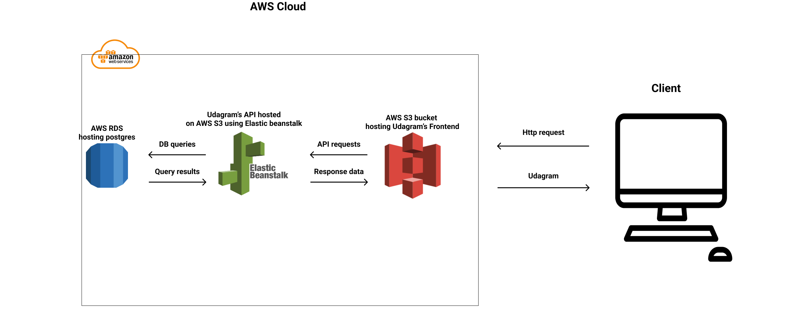
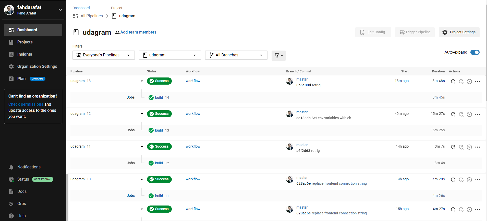

# Fullstack application hosting

### Live Demo: http://udagram-s3-fahd.s3-website-us-east-1.amazonaws.com

## How it works:
 - Frontend is hosted through AWS S3.
 - Backend API is hosted on AWS S3 using Elastic beanstalk.
 - Backend is linked to a Postgres DB using AWS RDS.

## Docs:
- [AWS used services](docs/AWS-services.md)
- [Pipeline](docs/pipeline.md)
- [Architecture diagram](docs/Architecture-diagram.md)

