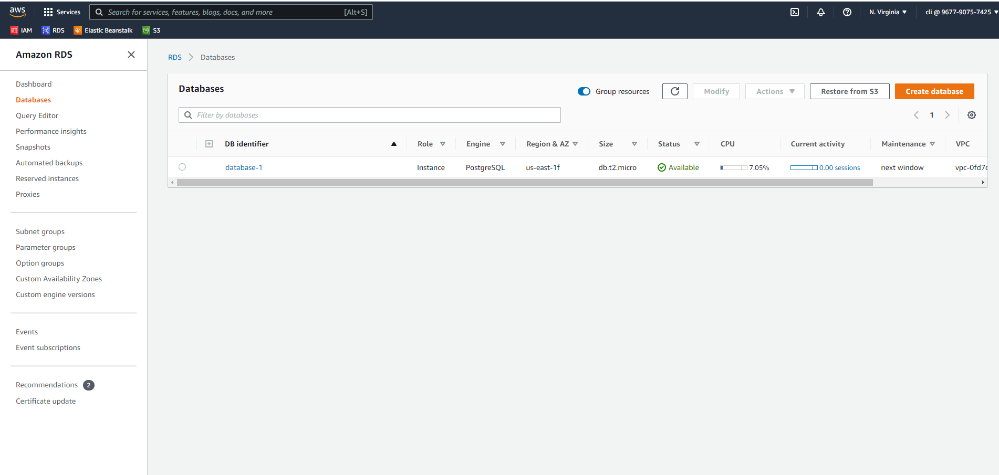
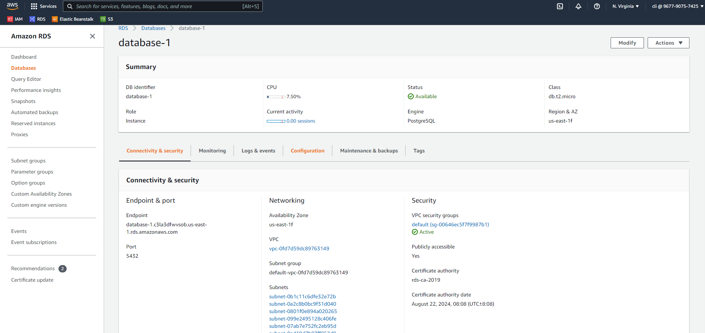

# Project dependencies 
### These are the AWS services needed to run the project.

## AWS RDS

## AWS S3 for hosting the frontend
- There are two buckets in this screenshot. The first one is created automatically by Elastic beanstalk to host the Backend API. The second one must be manually created for the frontend.

- This bucket should be publicly accessible since we want everyone to be able to visit the webpage.

## AWS Elastic beanstalk
- This shows that our EB environment is up and running with no issues.

