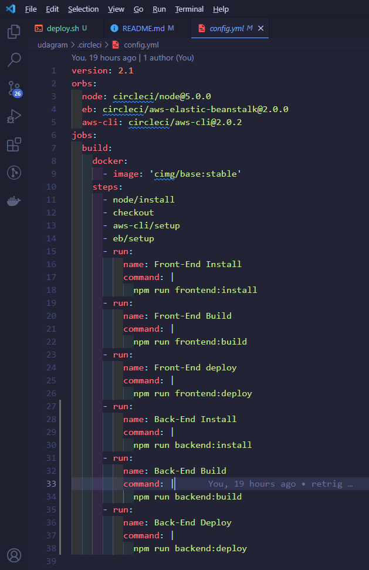
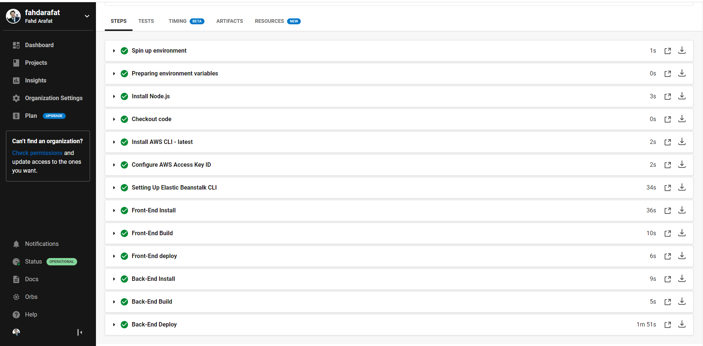
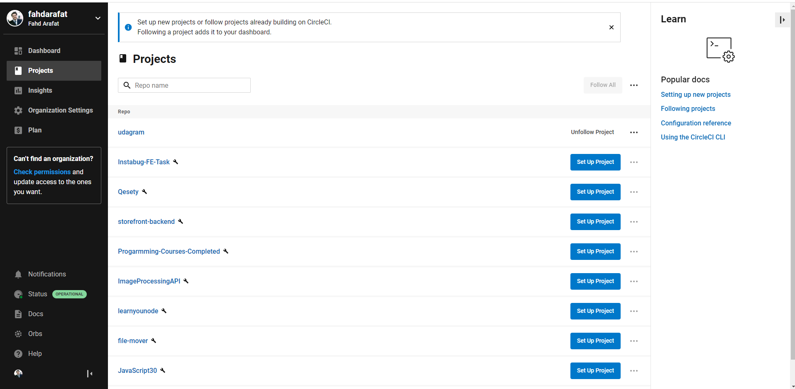
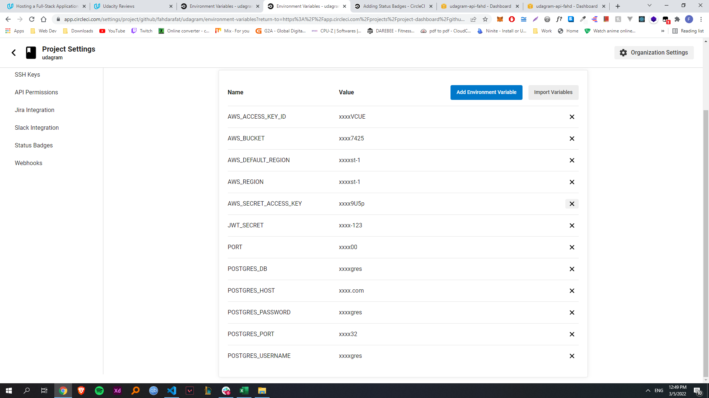

# Project pipeline

### These are the steps followed in the Circleci pipeline.
- We install the necessary orbs (dependencies)
- We specify the docker image that will run the pipeline
- Install frontend dependencies ==> Build project ==> Deploy to s3
- Install backend dependencies ==> Build backend ==> pass environment variables from CircleCi to EB ==> Deploy to EB.

  